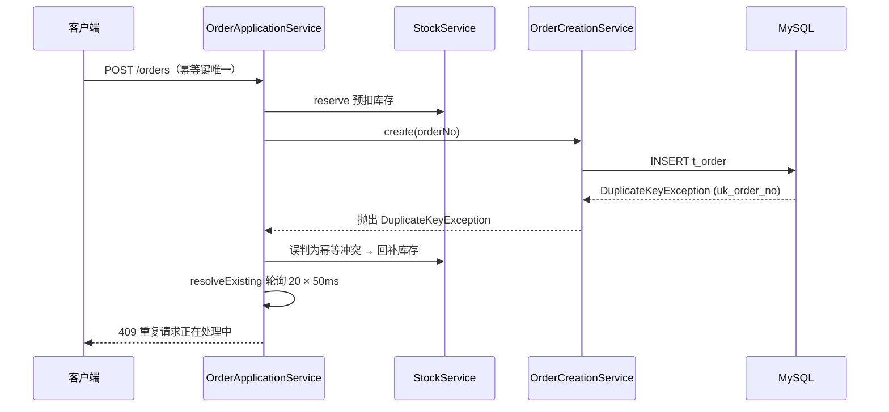
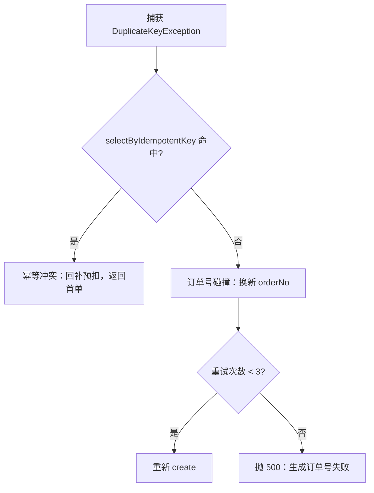

> D12 压测复盘系列（1/3）。

## TL;DR

一次 5000 请求的并发压测，出现了 **2 个 409**（0.04%）。日志信誓旦旦地说"命中幂等键唯一索引"，但数据库里根本没有这个幂等键——真正冲突的是**订单号**。

根因是把 `DuplicateKeyException` 一律当成了幂等冲突。修复分两步：

1. 订单号从「秒级时间戳 + 6 位随机」改成「毫秒时间戳 + 本地序列」；
2. `catch` 之后**主动查库**，用数据库的最终状态区分到底是哪个唯一约束冲突，而不是假设。

<!-- more -->

## 一、现象：4998 个 200 和 2 个 409

压测场景一：商品 P1001 库存充足，100 线程 × 50 循环 = 5000 请求，每个请求带**唯一**的幂等键 `x-idempotency-key: ${__UUID()}`。

结果：

- `4998 × HTTP 200`
- `2 × HTTP 409`（0.04%）

409 的响应体（统一错误结构）：

```json
{"code":409,"message":"重复请求正在处理中，请稍后重试","data":null}
```

应用日志里则出现了两条 WARN，内容几乎一样：

```text
WARN ... OrderApplicationService : 命中 uk_idempotent_key 唯一索引，返回已存在订单：idempotencyKey=2f1c9a...
```

日志把结论直接写死了：**幂等键冲突**。

## 二、第一反应与误区

按日志的说法，事情很简单：

- `DuplicateKeyException` = 唯一约束冲突；
- 唯一约束里有 `uk_idempotent_key`；
- 所以 = 幂等冲突；
- 于是回补库存、返回已存在订单。

但这套推理有一个说不通的地方：**每个请求的幂等键都是唯一的 UUID，哪里来的幂等冲突？**

如果真的发生了同键重放，正确的行为应该是返回**同一个订单号 + HTTP 200**（幂等语义），而不是 409。而 409 的语义是"重复请求正在处理中"，意味着代码去查"已存在的订单"时**什么都没查到**，轮询一秒后放弃了。

换句话说：日志在撒谎。

## 三、定位：冲突的到底是谁

顺着"查不到"这条线索往下查：

1. 拿那个 `idempotencyKey` 去数据库查 `t_order`：**查无此单**。
2. 统计同一秒内落库的订单数：高达 **165~170**。
3. 看一眼表结构，`t_order` 上有**两个**唯一索引：`uk_order_no`、`uk_idempotent_key`。
4. 再看代码：`catch (DuplicateKeyException)` 只有一个分支，**从来没区分过是哪个索引冲突**。

结论浮出水面：冲突的根本不是幂等键，而是**订单号** `uk_order_no`。代码把订单号碰撞误判成了幂等冲突，于是：

回补库存 → 去查一个不存在的幂等单 → 轮询 20 次 × 50ms → 超时 → 返回 409。



## 四、根因一：订单号碰撞（生日问题）

修复前的订单号生成器长这样：`yyyyMMddHHmmss`（秒）+ 6 位随机数。

问题在于：**同一秒内，前缀完全相同**，唯一性只由那 6 位随机数保证，空间大小 $N = 10^6$。

这就是经典的生日问题：从 $N$ 个值里独立均匀地取 $n$ 个，至少发生一次碰撞的概率约为

$$P(n) \approx 1 - \exp\left(-\frac{n(n-1)}{2N}\right)$$

代入 $N = 10^6$：

| 同一秒订单数 n | n(n-1)/2 | 碰撞概率 P(n) |
| --- | --- | --- |
| 50 | 1,225 | 0.12% |
| 100 | 4,950 | 0.49% |
| 150 | 11,175 | 1.11% |
| **170** | 14,365 | **1.43%** |
| 200 | 19,900 | 1.97% |
| 300 | 44,850 | 4.39% |

单看某个"170 单/秒"的一秒，碰撞概率才 1.43%，好像不高。但压测是持续压的：场景一大约跑了 33 秒，把每秒的期望碰撞数累加，

$$\lambda \approx 33 \times \frac{170 \times 169}{2 \times 10^6} \approx 0.47$$

于是整场压测至少撞一次的期望概率是

$$P(\ge 1) \approx 1 - e^{-\lambda} \approx 1 - e^{-0.47} \approx 37\%$$

也就是说，**这轮压测出现订单号碰撞，差不多是三成概率的事**，观测到 2 次完全在合理范围内。

一句话总结这个设计缺陷：**秒级时间戳 + 随机数，在"同一秒几百单"的量级下，迟早要交学费。**

## 五、根因二：宽泛异常的隐患

比订单号碰撞更值得警惕的，是第二层问题：**代码把一个"笼统"的异常，当成了"具体"的业务信号。**

`DuplicateKeyException` 是 Spring 对"唯一约束冲突"的抽象，它只告诉你"有唯一键冲突了"，**并不保证你能知道是哪一个约束**。而修复前的代码直接假设它一定是 `uk_idempotent_key`：

<details>
<summary>点击展开：修复前的关键代码</summary>

```java
// OrderNoGenerator：秒级时间戳 + 6 位随机
public static String generate() {
    String prefix = LocalDateTime.now().format(FORMATTER); // yyyyMMddHHmmss
    String suffix = String.format("%06d",
            ThreadLocalRandom.current().nextInt(RANDOM_BOUND)); // 0 ~ 999999
    return prefix + suffix;
}
```

```java
// OrderApplicationService.createOrder（节选）
try {
    stockService.reserve(productId, quantity);
    reserved = true;

    CreateOrderResponse response = orderCreationService.create(request, idempotencyKey);
    safePut(redisKey, response.getOrderNo());
    return response;
} catch (DuplicateKeyException ex) {
    // 默认认为是幂等键冲突：回补多余预扣，返回首单
    if (reserved) {
        stockService.release(productId, quantity);
    }
    log.warn("命中 uk_idempotent_key 唯一索引，返回已存在订单：idempotencyKey={}", idempotencyKey);
    return resolveExisting(idempotencyKey, redisKey); // 查不到 → 轮询超时 → 409
}
```

</details>

这不是"订单号碰撞"的孤例。想想看：只要未来再给 `t_order` 加任何唯一索引（比如设备指纹、外部渠道单号、幂等键加盐），这个 `catch` 都会变成一个**随时可能误触的隐患**——把 500、409、库存异常等各种行为都挂在它下面。

**异常处理的精确性，是健壮性的底线。** 捕获一个异常，就要说清楚"我到底假设它代表什么"；假设不成立时，行为必须是安全的。

## 六、修复

### 6.1 订单号：毫秒时间戳 + 本地序列

把秒级换成毫秒级，再补一个进程内的自增序列：

<details>
<summary>点击展开：修复后的订单号生成器</summary>

```java
/**
 * 格式：yyyyMMddHHmmssSSS（17 位毫秒）+ AtomicLong 3 位循环序列（共 20 位）。
 * 单机每毫秒最多 1000 个不重复订单号，且跨毫秒天然唯一；多实例/超高性能可换 Snowflake。
 */
public final class OrderNoGenerator {

    private static final DateTimeFormatter FORMATTER =
            DateTimeFormatter.ofPattern("yyyyMMddHHmmssSSS");
    private static final AtomicLong SEQUENCE = new AtomicLong();
    private static final long SEQUENCE_MOD = 1000L;

    public static String generate() {
        long seq = SEQUENCE.getAndIncrement() % SEQUENCE_MOD;
        return LocalDateTime.now().format(FORMATTER) + String.format("%03d", seq);
    }
}
```

</details>

要点：

- 毫秒前缀让碰撞空间从"每秒"缩小到"每毫秒"，配合序列号，同一毫秒内最多 1000 个不重复；
- `AtomicLong` 是进程内自增，天然无锁竞争（`getAndIncrement` 是 CAS）；
- 明确的边界：同一毫秒超过 1000 个请求序列会回绕——本地压测量级远达不到，真到了那个量级就该上 Snowflake 了。

### 6.2 异常区分：主动查库，而不是解析异常消息

订单号变强了，但"宽泛异常"的隐患还得从根上堵住。修复后的判定逻辑：

```java
for (int attempt = 0; attempt < MAX_ORDER_NO_RETRIES; attempt++) {
    String orderNo = OrderNoGenerator.generate();
    try {
        CreateOrderResponse response =
                orderCreationService.create(request, idempotencyKey, orderNo);
        safePut(redisKey, response.getOrderNo());
        return response;
    } catch (DuplicateKeyException ex) {
        // 主动查库：命中幂等键 = 真幂等冲突；未命中 = 订单号碰撞
        if (orderMapper.selectByIdempotentKey(idempotencyKey) != null) {
            stockService.release(productId, quantity);
            reserved = false;
            return resolveExisting(idempotencyKey, redisKey);
        }
        // 订单号碰撞：换号重试
        log.warn("订单号碰撞，换号重试：orderNo={}, attempt={}", orderNo, attempt + 1);
    }
}
throw new BusinessException(ErrorCode.SERVER_ERROR, "生成订单号失败，请重试");
```



### 6.3 为什么不用 `e.getMessage()` 解析约束名？

一个很自然的想法是：从异常消息里揪出约束名，比如

```java
if (ex.getMessage().contains("uk_order_no")) { ... }
```

这条路看似直接，实则脆弱：

- **依赖底层驱动**。MySQL 的消息形如 `Duplicate entry '...' for key 'uk_order_no'`，但 PostgreSQL、Oracle 的格式完全不同；
- **依赖数据库版本**。同一种数据库的不同版本，消息模板也可能变化；
- **静默失效**。一旦升级驱动、换库或改约束名，基于字符串匹配的逻辑会在没有任何编译错误的情况下悄悄失效——这比直接报错更可怕。

而 `selectByIdempotentKey` 依赖的是**数据库的最终状态**：不管底层怎么抛异常，我只问数据库"这个幂等键对应的订单在不在"。这才是跨数据库、跨驱动都成立的事实。

## 七、复测结果

- 场景一：**5000 × 200，0 错误**；
- 库存正确、无负库存；
- `t_order` 5000 单 / 5000 个唯一幂等键；
- 应用日志中不再出现订单号碰撞（换号重试分支一次都没进）。

那个 0.04% 的 409 彻底消失了。

## 八、复盘与面试口径

| 主题 | 一句话口径 |
| --- | --- |
| 宽泛异常 | `DuplicateKeyException` 只表示"有唯一键冲突"，不保证你知道是哪个；**主动查库**用最终状态区分（查幂等键命中=幂等冲突，未命中=订单号碰撞），不要解析驱动消息。 |
| 高并发唯一 ID | 秒级时间戳 + 随机数在 ~170 单/秒就会出现生日碰撞；改用毫秒时间戳 + 本地 `AtomicLong` 序列；多实例或更高性能再上 Snowflake。 |
| 异常处理精确性 | 每个 `catch` 都要写清"我假设这个异常代表什么"；假设不成立时行为必须安全——否则未来新增唯一约束时，旧 `catch` 会变成隐患。 |
| 排障方法 | 日志结论不可全信；用数据库状态反证（"说是幂等冲突，可库里没有这个键"）往往能一击定位。 |

## 九、系列预告

本文是这个系列的第 1 篇。后续两篇：

- **2/3** [《差点踩中事务回滚陷阱：`@Transactional` + `catch` + 重试引发的 `UnexpectedRollbackException`》]()
- **3/3** [《单机压测复盘：`QPS ≈ 并发 / 平均延迟`，以及连接池到底该不该扩》]()

## 十、附：复现说明（JMeter 关键配置）

| 项 | 值 |
| --- | --- |
| 工具 | Apache JMeter 5.6.3（非 GUI） |
| 请求 | `POST /api/orders` |
| Header | `x-idempotency-key: ${__UUID()}`、`Content-Type: application/json` |
| Body | `{"userId":"U-load-${__Random(1,10000)}","productId":"${product}","quantity":1}` |
| 线程组 | 100 线程 × 50 循环，无 Timer（极限施压） |
| 环境 | 单机压测，JMeter 与被测应用**共享同一台机器 CPU**，MySQL/Redis/Kafka 亦同机容器；数据仅作本地基线参考，非生产基准 |

> 说明：幂等键用 `__UUID()` 保证每请求唯一，确保真实落到扣库存与落单逻辑；`userId` 随机化以模拟多用户，避免单用户维度的锁/限流干扰。

## 参考

- [Spring `DuplicateKeyException`](https://docs.spring.io/spring-framework/docs/current/javadoc-api/org/springframework/dao/DuplicateKeyException.html)
- [MySQL 唯一索引与 `Duplicate entry` 错误](https://dev.mysql.com/doc/refman/8.0/en/constraint-unique.html)
- [Birthday problem（生日问题）](https://en.wikipedia.org/wiki/Birthday_problem)
