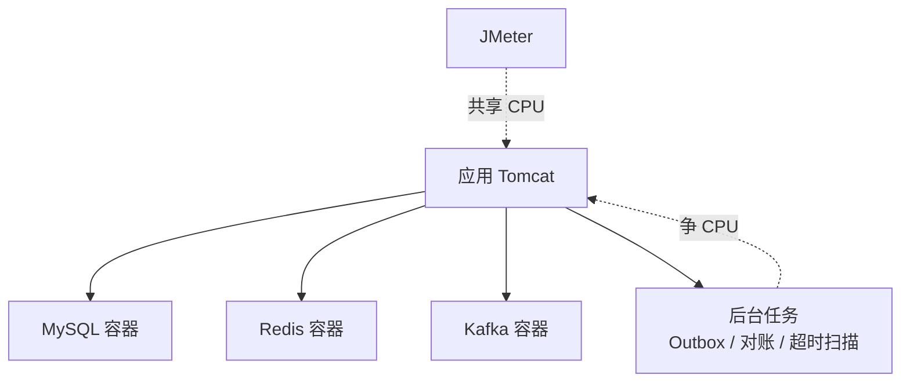

> D12 压测复盘系列（3/3）。上篇：[差点踩中事务回滚陷阱]()；首篇：[5000 个请求里的 2 个 409]()。

## TL;DR

修完订单号 Bug 后，我把 Hikari 连接池从 10 扩到 30，期待吞吐起飞。结果：

- QPS：**150.6 → 155.8**（仅 +3.5%）
- P99：**907ms → 809ms**（-11%）
- Max：**7424ms → 1017ms**（-86%）

扩池明显改善了**尾延迟**，却几乎没提升**吞吐**。这篇文章用 Little's Law 解释为什么，并给出一个反直觉的结论：

> **连接池调优的本质是"减少排队等待"，而不是"提升系统算力"。当 QPS 不涨时，瓶颈已经转移到别处了。**

<!-- more -->

## 一、压测设计

**环境（务必先看这条）**：单机压测，JMeter 与被测应用**共享同一台机器的 CPU**，MySQL / Redis / Kafka 也都是同机容器。所以下面的数据是**本地演示参考，不是生产基准**。

**工具**：Apache JMeter 5.6.3（非 GUI）。

**两个场景**：

| 场景 | 目的 | 参数 |
| --- | --- | --- |
| 场景一 | 吞吐 / 延迟 | P1001 库存充足，100 线程 × 50 循环 = 5000 请求 |
| 场景二 | 不超卖 | P1002 库存 100，100 线程 × 3 循环 = 300 请求 |

**JMeter 关键配置**：

| 项 | 值 |
| --- | --- |
| 请求 | `POST /api/orders` |
| Header | `x-idempotency-key: ${__UUID()}`、`Content-Type: application/json` |
| Body | `{"userId":"U-load-${__Random(1,10000)}","productId":"${product}","quantity":1}` |
| 线程组 | 100 线程、ramp 1s、50 循环 |
| 定时器 | **无**（极限施压，无思考时间） |

幂等键每请求唯一，确保真正落到扣库存与落单逻辑；`userId` 随机化模拟多用户。

## 二、基线数据：明显的"排队"

修复前（Hikari `maximum-pool-size = 10`），场景一：

| 指标 | 值 |
| --- | --- |
| 成功 / 错误 | 4998 × 200 / 2 × 409 |
| QPS | 150.6 /s |
| P50 / P90 / P95 / P99 | 649 / 724 / 741 / 907 ms |
| Avg / Max | 642 / 7424 ms |

特征很典型：**100 并发抢 10 个数据库连接**，平均等待时间与 Avg 642ms 高度吻合。看着就像"连接池太小了"。

## 三、Little's Law：QPS 到底由什么决定

Little's Law（利特尔法则）说：系统里的平均请求数 $L$，等于到达率 $\lambda$ 乘以平均逗留时间 $W$：

$$L = \lambda W$$

反过来，到达率（在稳态下就是吞吐）为：

$$\lambda = \frac{L}{W} \quad\Rightarrow\quad QPS \approx \frac{\text{并发}}{\text{平均延迟}}$$

代入基线数据（100 并发、Avg 0.642s）：

$$\frac{100}{0.642} \approx 155.8$$

与实测 QPS 150.6 基本吻合。这条公式的价值不在"算得准"，而在于它给出了**提吞吐的两条路**：

1. 增加并发（更多线程 / 连接）；
2. 降低平均延迟（优化 SQL、减少往返、异步化）。

**如果你只增加了并发，但平均延迟没变，QPS 就不会变。** 这正是后面扩池实验的伏笔。

## 四、调优：把连接池从 10 扩到 30

- Hikari `maximum-pool-size`：10 → 30；
- `connection-timeout` 保持 3000ms（连接池打满时快速失败，避免请求堆积）；
- Tomcat 线程未动（默认已足够）；
- 复测前 `FLUSHDB` + 复位库存，保证基线一致。

结果对比：

| 指标 | 基线（pool=10） | 修复 Bug + pool=30 | 变化 |
| --- | --- | --- | --- |
| 成功 / 错误 | 4998×200 / 2×409 | **5000×200 / 0** | 错误清零 |
| QPS | 150.6 /s | 155.8 /s | +3.5% |
| P50 | 649 ms | 626 ms | -3.5% |
| P90 | 724 ms | 675 ms | -6.8% |
| P95 | 741 ms | 692 ms | -6.6% |
| P99 | 907 ms | **809 ms** | **-11%** |
| Avg | 642 ms | 626 ms | -2.5% |
| Max | 7424 ms | **1017 ms** | **-86%** |

## 五、三个反直觉但正确的结论

### 结论一：连接池不是吞吐的万能药

扩池后 QPS 只涨了 3.5%，但 P99 降了 11%、Max 降了 86%。

这说明扩池消除的是**排队带来的延迟抖动**，而不是"让系统算得更快"。连接池只是让请求少等一会儿，它不改变每个请求本身的处理成本。当 QPS 几乎不动时，说明瓶颈已经不在连接池了。

### 结论二：QPS ≈ 并发 / 平均延迟，是一个思维工具

再用一次 Little's Law 看调优后：`100 / 0.626 ≈ 159.7`，与实测 155.8 吻合。公式告诉我们：

- 想提 QPS，要么**加并发**，要么**降平均延迟**；
- 盲目扩池属于"加并发"，但只要平均延迟不变，QPS 就上不去；
- 真正的破局点是**降延迟**——也就是下面要定位的东西。

### 结论三：QPS 更高的场景二，恰恰是因为"快速失败"

场景二 QPS 高达 **345.6 /s**，远超场景一的 155.8。但这不是"系统变快了"，而是：

- 300 个请求里，**100 个成功（200）+ 200 个库存不足（422）**，其中 66.7% 走的是**快速失败**路径；
- 422 路径不做数据库写入、不做 Redis Lua 扣减，几乎是"立刻返回"。

**高 QPS ≠ 高性能，要看它处理的是什么类型的请求。** 拿一个"大部分请求都被快速拒绝"的场景去对比"每个请求都要落库"的场景，是没有意义的。

场景二数据（附库存校验）：

| 指标 | 结果 |
| --- | --- |
| 响应 | 100 × 200 + 200 × 422，0 × 5xx |
| QPS | 345.6 /s |
| P50 / P90 / P95 / P99 | 61 / 242 / 300 / 357 ms |
| 库存校验 | DB `available=0`、无负库存、成功订单=100、Redis `stock:P1002=0` |

## 六、那瓶颈到底在哪？

既然不是连接池，把单次请求的成本摊开看：

- **数据库往返**：幂等预检查询 1 次 + 落单事务内约 5 次写 SQL（`insert` 订单、扣库存 `update`、两次状态 `update`、`outbox` `insert`）；
- **Redis 往返**：幂等 `SETNX` 1 次 + 库存 Lua 扣减 1 次；
- **后台任务争 CPU**：Outbox 投递（5s 扫描）、回执对账（10s）、超时扫描（60s）都在同一台机器上跑；
- **单机共享资源**：JMeter、应用、MySQL、Redis、Kafka 共用一颗 CPU。

所以这是一个**单机 CPU / 端到端 I/O 往返受限**的场景，而不是连接池受限。后续真正的调优方向应该是：减少状态 `UPDATE`、合并/减少 SQL 往返、把部分链路异步化——而不是继续加连接。

## 七、压测方法论

一次有效的压测，流程应该是这样的：


flowchart LR
    A["冒烟 1 线程 1 循环"] --> B["极限压测 无思考时间"]
    B --> C["记录 QPS / 分位 / 错误分布"]
    C --> D["先修 Bug"]
    D --> E["再调优"]
    E --> F["复测对比"]
    F --> C


几条经验：

1. **先修 Bug，再调优。** 带着 Bug 调优，错误（如订单号碰撞的 409）会淹没真实瓶颈——这也是本系列首篇的教训。
2. **分位 > 均值。** 基线 Avg 642ms 看着还行，但 Max 高达 7424ms；只看均值会漏掉尾延迟问题。
3. **记录错误分布。** 不能只看"成功/失败"，还要看 4xx/5xx 各占多少、分别是什么原因。
4. **单机压测必须注明共享资源。** 客户端与服务端抢 CPU 时，数据只能横向对比自己的改动，不能当生产基准。
5. **调优要有假设。** "扩池"的假设是"瓶颈在连接等待"；如果 QPS 没按预期变化，就说明假设错了，要回到数据找真正的瓶颈。

## 八、复盘与面试口径

| 主题 | 一句话口径 |
| --- | --- |
| Little's Law | `QPS ≈ 并发 / 平均延迟`；想提吞吐要么加并发、要么降延迟；盲目扩池若平均延迟不变，QPS 不会变。 |
| 连接池调优 | 扩池改善的是排队导致的尾延迟（P99/Max），不是系统算力；QPS 不涨说明瓶颈在别处。 |
| 高 QPS 的陷阱 | 高 QPS 不等于高性能；要区分请求类型（如快速失败的 422 会拉高 QPS）。 |
| 压测方法 | 冒烟 → 极限 → 记录 QPS/分位/错误分布 → 先修 Bug → 再调优 → 复测；单机数据注明共享 CPU。 |
| 瓶颈定位 | 拆解单请求成本（SQL/Redis 往返、后台任务、CPU），而不是猜"池子太小"。 |

## 九、系列回顾

- 1/3 [《5000 个请求里的 2 个 409：`DuplicateKeyException` 不等于幂等冲突》]()
- 2/3 [《差点踩中事务回滚陷阱：`@Transactional` + `catch` + 重试引发的 `UnexpectedRollbackException`》]()
- 3/3 本篇

## 参考

- [Little's Law（利特尔法则）](https://en.wikipedia.org/wiki/Little%27s_law)
- [HikariCP — Configuration](https://github.com/brettwooldridge/HikariCP#configuration-knobs-baby)
- [Apache JMeter](https://jmeter.apache.org/)
