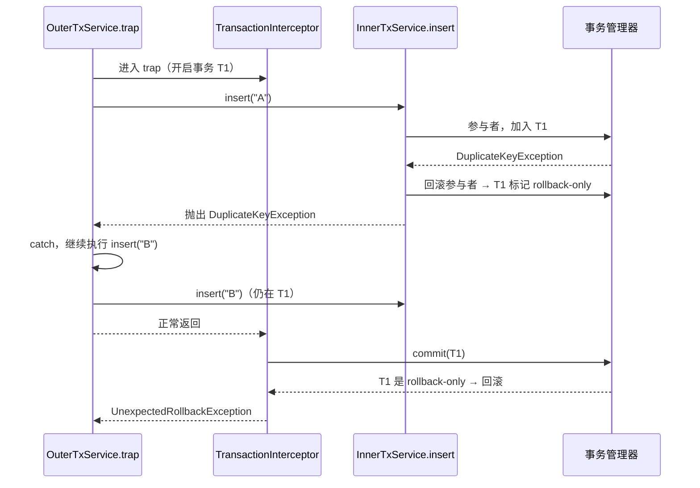
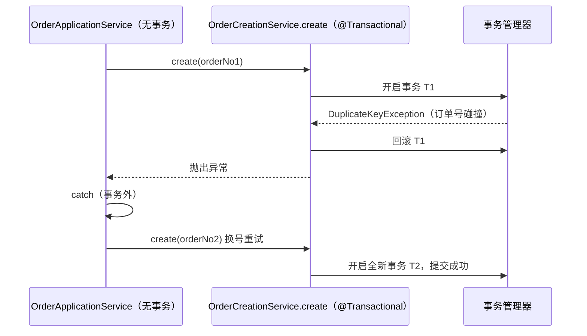

> D12 压测复盘系列（2/3）。上篇：[5000 个请求里的 2 个 409]()。

## TL;DR

上篇里，为了处理订单号碰撞，我给"落单"加了一层 **catch + 重试**。写完那一刻我意识到一个更危险的问题：

**如果这段"catch 住唯一键异常再重试"的代码，被写在一个 `@Transactional` 方法里，会怎样？**

答案是：重试的 SQL 确实执行了，但**数据不会落库**，最终外层提交时抛出 `UnexpectedRollbackException`。这不是推演——本文附了一个可独立运行的实验，真实复现了这个异常。

<!-- more -->

## 一、悬念：把重试放进事务会怎样

上篇的修复逻辑大概是这样（简化）：

```java
for (int attempt = 0; attempt < 3; attempt++) {
    try {
        create(request, idempotencyKey, orderNo); // 落单
        return;
    } catch (DuplicateKeyException ex) {
        orderNo = nextOrderNo(); // 换号重试
    }
}
```

这段代码**目前是安全的**，原因后面讲。但先做一个思想实验：如果给这个方法加上 `@Transactional`，会怎样？

直觉上，`catch` 住异常、继续重试、最后正常返回，应该没问题才对。事实恰恰相反。

## 二、陷阱版代码

我用两个 Spring bean 复刻了这个结构（完整代码见文末仓库链接）：

```java
static class InnerTxService {
    private final JdbcTemplate jdbc;

    @Transactional // 默认 REQUIRED：外层有事务就加入
    public void insert(String id) {
        jdbc.update("INSERT INTO exp_tx(id) VALUES (?)", id);
    }
}

static class OuterTxService {
    private final InnerTxService inner;

    @Transactional // 陷阱：外层也开了事务
    public void trap() {
        try {
            inner.insert("A"); // A 已存在 → 唯一键冲突
        } catch (DuplicateKeyException ex) {
            inner.insert("B"); // 在"同一个事务"里继续
        }
    }
}
```

实验直接调用 `outer.trap()`，并预置一行 `A` 制造唯一键冲突。

## 三、真实结果：异常不是立刻炸的

跑出来的结果（真实控制台输出）：

```text
org.springframework.transaction.UnexpectedRollbackException: Transaction rolled back because it has been marked as rollback-only
    at org.springframework.transaction.support.AbstractPlatformTransactionManager.processRollback(AbstractPlatformTransactionManager.java:937)
    at org.springframework.transaction.support.AbstractPlatformTransactionManager.commit(AbstractPlatformTransactionManager.java:753)
    at org.springframework.transaction.interceptor.TransactionAspectSupport.commitTransactionAfterReturning(TransactionAspectSupport.java:676)
    at org.springframework.transaction.interceptor.TransactionAspectSupport.invokeWithinTransaction(TransactionAspectSupport.java:426)
    at org.springframework.transaction.interceptor.TransactionInterceptor.invoke(TransactionInterceptor.java:119)
    at ...$OuterTxService$$SpringCGLIB$$0.trap(<generated>)
    at ...TransactionRollbackOnlyExperimentTest.trapShouldThrowUnexpectedRollbackException(...:54)
```

两个关键事实：

1. 异常**不在 `catch` 处抛出**，而是在外层方法**返回、事务提交时**才抛出；
2. 测试断言 `B` 的写入**未落库**——那句 `inner.insert("B")` 执行了，但整个事务被回滚了。

> 注意堆栈：它来自 `AbstractPlatformTransactionManager.processRollback`，由 `commit()` 调用。也就是说，外层以为要"提交"，事务管理器却发现"这事只能回滚"，于是抛出 `UnexpectedRollbackException`。

## 四、原理：异常被 catch 了，事务状态没有

这段机制拆开其实很清楚。

**第一步：声明式事务的本质是代理。** `@Transactional` 不改变方法本身，而是由 `TransactionInterceptor` 在方法调用前后包一层：进入时开启/加入事务，正常返回时提交，抛异常时回滚。

**第二步：默认回滚规则。** Spring 默认只对 `RuntimeException` / `Error` 回滚；`DuplicateKeyException` 是 `RuntimeException`，所以会触发回滚。

**第三步：内层事务"加入"外层。** 内层 `@Transactional` 用的是默认传播 `REQUIRED`——外层已有事务，内层**不新建**，而是加入同一个物理事务。

**第四步：关键的一步。** 内层方法抛异常时，事务拦截器要"回滚"。但由于它是**参与者**（不是新事务），事务管理器不会真的把整个事务回滚掉，而是把这个**共享事务标记为 `rollback-only`**（只可回滚）。

**第五步：`catch` 管不到事务状态。** 外层 `catch` 抓住的是 **Java 异常对象**，而 `rollback-only` 是挂在**事务状态**上的。异常没了，标记还在。

**第六步：提交时爆雷。** 外层方法正常返回，`TransactionInterceptor` 调用 `commit()`；`AbstractPlatformTransactionManager.commit()` 一看事务已被标记 `rollback-only`，只能回滚，并抛出 `UnexpectedRollbackException`。



一句话总结：**`catch` 吃掉的是异常，不是事务的"死刑判决"。**

## 五、为什么它比"直接报错"更危险

如果异常直接抛出去，你会立刻发现。而这个陷阱的可怕之处在于：

- 重试的 SQL **执行了**，日志、监控上看起来"成功"；
- 返回值**正常**，调用方以为一切 OK；
- 直到最终提交，才抛出一个和业务毫无关系的 `UnexpectedRollbackException`；**数据已经悄悄没了**。

这类问题在生产上往往表现为"偶发丢单"，而且堆栈指向事务框架，排查成本极高。

## 六、修正版：两个正确方向

我加了两个修正版，都在实验里跑通、数据正常落库。

### 6.1 方向一：`REQUIRES_NEW`，让易失败的写入各自独立事务

```java
@Transactional(propagation = Propagation.REQUIRES_NEW)
public void insertInNewTx(String id) {
    jdbc.update("INSERT INTO exp_tx(id) VALUES (?)", id);
}
```

`REQUIRES_NEW` 会**挂起外层事务、开启一个新事务**。内层失败只回滚它自己的事务，不会污染外层；外层 catch 后重试的是另一个新事务，提交正常。

真实结果：`[REQUIRES_NEW 修正版] B 已落库，无异常`。

### 6.2 方向二：让重试发生在事务之外（编排层）

```java
public void fixedByOrchestration() { // 外层不做事务
    try {
        inner.insert("A");
    } catch (DuplicateKeyException ex) {
        inner.insert("B");
    }
}
```

外层方法**不带 `@Transactional`**，catch 发生时根本没有事务上下文，`insert` 的一次调用就是一个独立事务。这是本项目采用的方式（下面详述）。

真实结果：`[事务外编排修正版] B 已落库，无异常`。

### 6.3 传播行为对比

| 传播行为 | 含义 | 在本场景的效果 |
| --- | --- | --- |
| `REQUIRED`（默认） | 有事务就加入，没有就新建 | 内层失败会拖垮外层（rollback-only） |
| `REQUIRES_NEW` | 挂起当前事务，新建独立事务 | 内层失败不影响外层，重试安全 |
| `NESTED` | 在当前事务内建 savepoint | 可回滚到 savepoint；但依赖具体事务管理器（如 `DataSourceTransactionManager`） |

### 6.4 一个走不通的"偏方"

网上偶有建议：手动调用 `TransactionAspectSupport.currentTransactionStatus().setRollbackOnly(false)` 把标记清掉。**这条路不成立**——`TransactionStatus` / `TransactionExecution` 只提供了 `setRollbackOnly()`（标记为只回滚），**没有受支持的公开方法能清除标记**。依赖反射去改内部状态，等于给自己埋雷。

## 七、反转：我的系统为什么没踩这个坑

回到上篇的代码。本项目从一开始就把**编排**和**落单事务**拆开了：

- `OrderApplicationService`（**没有** `@Transactional`）：负责幂等抢占、库存预扣、换号重试、catch 异常，纯编排；
- `OrderCreationService.create`（`@Transactional`）：只负责"插订单 + 扣库存 + 流转状态"这一本地事务。

```java
// OrderApplicationService：类注释明确"本类不做事务；落单事务在 OrderCreationService"
public CreateOrderResponse createOrder(CreateRequest request, String idempotencyKey) {
    // 幂等抢占 → 预检 → 库存预扣
    for (int attempt = 0; attempt < MAX_ORDER_NO_RETRIES; attempt++) {
        String orderNo = OrderNoGenerator.generate();
        try {
            return orderCreationService.create(request, idempotencyKey, orderNo); // 独立事务
        } catch (DuplicateKeyException ex) {
            if (orderMapper.selectByIdempotentKey(idempotencyKey) != null) {
                // 幂等冲突
            }
            // 订单号碰撞：换号重试
        }
    }
}
```

于是重试链路天然安全：

1. `create` 抛 `DuplicateKeyException` → 它的**内层事务**回滚并向上抛；
2. 外层 `createOrder` **不在事务中**，catch 后 `selectByIdempotentKey` 走的是一条**新的自动提交连接**，读到的是已提交状态；
3. 换号重试再调 `create` → **全新事务**。



这也是一个值得记住的结论：**良好的分层本身就能规避一整类框架陷阱**。把"易失败的写操作"收进独立的事务单元，把"重试/补偿/编排"放在事务之外，比在事务里玩传播行为更清晰。

## 八、几个相关的坑（面试常问）

1. **自调用会让 `@Transactional` 失效。** 同一个类里 `this.method()` 调用不经过代理，注解形同虚设。所以事务方法要能被 Spring 代理到（跨 bean 调用），或注入自身代理。
2. **checked exception 默认不回滚。** Spring 默认只对 `RuntimeException` / `Error` 回滚；受检异常需要显式 `rollbackFor`。
3. **`REQUIRES_NEW` 不是免费的。** 它会挂起外层事务、额外占用一个数据库连接（高并发下要小心连接池），且外层后续失败也**无法回滚**内层已提交的事务——原子性范围变了。
4. **别用 `setRollbackOnly(false)` 当解药。** 如上所述，没有受支持的清除方式。

## 九、复盘与面试口径

| 主题 | 一句话口径 |
| --- | --- |
| `UnexpectedRollbackException` | 事务被标记 `rollback-only` 后仍尝试提交，提交时抛出；常发生在"内层事务失败被外层 catch 后继续"的场景。 |
| 为什么 catch 没用 | `catch` 捕获的是异常对象，`rollback-only` 是事务状态；两者不在一个层面。 |
| 正确解法 | 把易失败的写操作放进独立事务（`REQUIRES_NEW`），或让重试/补偿发生在**事务之外**的编排层。 |
| 架构启示 | "编排层非事务 + 事务单元独立"能从结构上规避事务陷阱，比在事务里调传播更清晰。 |
| 相关考点 | 事务传播、`rollback-only`、`UnexpectedRollbackException`、自调用失效、checked exception 默认不回滚。 |

## 十、可复现证据

本文的实验是**可独立运行**的，基于项目测试用 H2 内存库，不依赖 MySQL/Redis/Kafka：

```powershell
mvn "-Dfile.encoding=UTF-8" -Dtest=TransactionRollbackOnlyExperimentTest test
```

输出（真实）：`Tests run: 3, Failures: 0, Errors: 0, Skipped: 0`，其中陷阱版用例捕获到上述 `UnexpectedRollbackException`，修正版两条用例数据正常落库。

代码：<https://github.com/xlegq883/trading-order-service/blob/111f716/src/test/java/com/fuzuyang/trading/experiment/TransactionRollbackOnlyExperimentTest.java>

## 十一、系列预告

- 上篇（1/3）：《5000 个请求里的 2 个 409：`DuplicateKeyException` 不等于幂等冲突》
- 下篇（3/3）：《单机压测复盘：`QPS ≈ 并发 / 平均延迟`，以及连接池到底该不该扩》

## 参考

- [Rolling Back a Declarative Transaction — Spring Framework](https://docs.spring.io/spring-framework/reference/data-access/transaction/declarative/rolling-back.html)
- [`UnexpectedRollbackException` — Spring Framework API](https://docs.spring.io/spring-framework/docs/current/javadoc-api/org/springframework/transaction/UnexpectedRollbackException.html)
- [`Propagation` — Spring Framework API](https://docs.spring.io/spring-framework/docs/current/javadoc-api/org/springframework/transaction/annotation/Propagation.html)
- [`TransactionStatus` — Spring Framework API](https://docs.spring.io/spring-framework/docs/current/javadoc-api/org/springframework/transaction/TransactionStatus.html)
